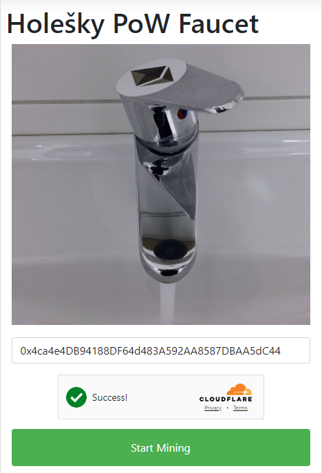

# Setup MetaMask to use Holesky Ethereum Testnet
We need to use MetaMask as it is seems to be working best connecting web3 wallets to the testnet in Edge or Chrome.

Goals:
1. Get HolETH for testing validators and staking and paying gas fees
2. Get HolSSV for testing funding validators and staking
3. Setup a validator on SSV.network
4. Setup an operator on SSV.network
5. Try out re-staking

Open your browser, Edge in this example, search for MetaMask add the extension and create new wallet, save seed words.

---
# 1. add MetaMask to browser

---
---
# 2. create MetaMask wallet or restore

---
---
# 3. make extension visible

---
---
# 4. change network from Mainnet to new network

---
---
# 5. Add network

---
---
# 6. Add a network manually

---
---
# 7. Holesky Network settings

---
---
# 8. Switch to Holesky Testnet

---
---
# 9. Check if Holesky Testnet selected ETH should have circle H on it then click Import tokens

---
---
# 10. add ssv contract address for holesky

---
---
# 11. Tokens have h symbol - Holesky Testnet selected

---
---
# 12. Start mining HolEth for testnet use, make sure MetaMask is set to Holesky network.
# https://holesky-faucet.pk910.de/

---
---
# 13. Get SSV from testnet, may sure to connect MetaMask as the Holesky Network
# https://faucet.ssv.network/

---
